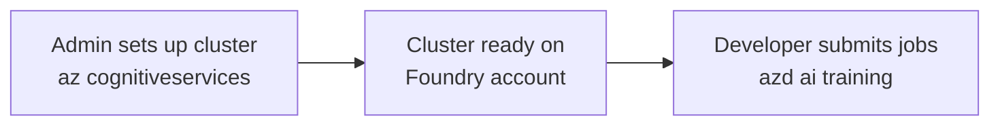

# Use the CLI for custom training in Microsoft Foundry

You can run the full custom training workflow from the command line. This article covers the Foundry-specific CLI surface in the order you need it:

- **Part 1: Set up compute (admin)** uses `az cognitiveservices`. This is the one-time setup a platform admin does so that data scientists have a GPU cluster to submit jobs against.
- **Part 2: Submit and manage training jobs (developer)** uses `azd ai training`. This is the loop ML engineers and data scientists run every day.

The CLI and the [Foundry portal](https://ai.azure.com) work against the same project. A job submitted from the CLI shows up in the portal, and a cluster created in the portal can be targeted by `azd ai training job submit` from a script.

> **Important**
>
> The `az cognitiveservices account compute`, `az cognitiveservices rbac`, and `azd ai training` command groups are currently in preview. Command names, flags, and output shape can change between preview releases. If you wire these commands into CI or scripts you plan to keep running, pin specific versions of the Azure CLI, azd, and the training extension.



*Figure: an admin uses* `az cognitiveservices` *to set up a GPU cluster on a Foundry account, then a developer uses* `azd ai training` *to submit jobs against that cluster.*

If you're new to custom training in Foundry, start with [Custom code training overview](Custom-Code-training-Overview.md).

## Before you begin

You need the following on the machine you're running commands from. Where a step is a standard Azure CLI or azd action, this article links to the official docs instead of restating commands.

### Tools and SDKs

- **Azure CLI**, installed and current. See [Install the Azure CLI](https://learn.microsoft.com/cli/azure/install-azure-cli) and [Update the Azure CLI](https://learn.microsoft.com/cli/azure/update-azure-cli).
- **Azure Developer CLI (azd)**, installed. See [Install or update the Azure Developer CLI](https://learn.microsoft.com/azure/developer/azure-developer-cli/install-azd).
- **The AI training extension** for the Azure CLI. Install it with `az extension add --name <extension-name>`. Confirm the exact registry name with your team; preview extensions sometimes use a hyphenated name (such as `ai-training`) rather than a dotted form. See [Use and manage extensions with the Azure CLI](https://learn.microsoft.com/cli/azure/azure-cli-extensions-overview) for install, update, list, and remove instructions.

### Authentication and subscriptions

- **Signed in to Azure**. See [Sign in with the Azure CLI](https://learn.microsoft.com/cli/azure/authenticate-azure-cli) and [Authenticate with the Azure Developer CLI](https://learn.microsoft.com/azure/developer/azure-developer-cli/azd-auth-login).
- **The correct subscription selected**. See [Manage Azure subscriptions with the Azure CLI](https://learn.microsoft.com/cli/azure/manage-azure-subscriptions-azure-cli).

### Foundry resources

- **A Foundry resource and project** you can target. See [Set up an enterprise-ready project](How-to-set-up-an-enterprise-ready-project-in-Foundry.md) for the admin flow and [Pre-requisites](Pre-requisites.md) for the developer prerequisites.
- **At least the Azure AI User role on the project** (Part 2 / developer audience). Platform admins setting up compute (Part 1) need a role with compute write permissions on the Foundry account, such as **Azure AI Project Manager**. To check what your signed-in identity holds, run `az cognitiveservices rbac check` (shown in [Part 1, Step 1](#step-1-verify-your-access)).

> **Note**
>
> Throughout this article, replace placeholders like `<rg>`, `<account>`, `<project-endpoint>`, and `<cluster-name>` with your own values. The project endpoint is shown on your project's **Overview** page in the Foundry portal.

> **Note**
>
> Multi-line examples in this article use bash backslash (`\`) line continuations. On Windows cmd, replace `\` with `^`; in PowerShell, use a backtick (`` ` ``). Or run the command on a single line.

## CLI surfaces and flag precedence

The two CLI surfaces accept different flag sets. Use this table to find the right flag for the command you're running. When in doubt, run the command with `--help`.

| Flag | `az cognitiveservices` | `azd ai training` | Purpose |
|------|------------------------|-------------------|---------|
| `--subscription` | Yes | No (resolved from the cached endpoint after `azd ai training init`) | Target subscription. |
| `--resource-group` | Yes | No (resolved from the cached endpoint after `azd ai training init`) | Target resource group. |
| `--project-endpoint` | No | Yes | Target Foundry project. `azd ai training` resolves resource group and tenant from this value. |
| `--output` / `-o` | `table` (default), `json`, `yaml` | Check `--help` for the formats your version supports | Output format. |
| `--only-show-errors` | Yes | Check `--help` | Suppress warnings; useful in CI. |
| `--debug` | Yes | Yes | Verbose request and response details. |
| `--yes` | Yes | Yes | Skip confirmation prompts (use for destructive actions in scripts). |
| `--config` | Yes | Check `--help` | Path to a CLI config file with default values. |

For `az cognitiveservices` commands, values are resolved in this precedence order, highest first:

1. Command-line flags.
1. Environment variables.
1. Config file (`--config`).
1. Built-in defaults.

For `azd ai training` commands, values typically come from command-line flags first, then the project endpoint cached by `azd ai training init` (see [Part 2, Step 1](#step-1-initialize-your-cli-context)).

For automation, prefer `--output json` and parse the structured response. JSON output from `azd ai training` commands includes a stable `jobId` and `status`, plus the portal link returned at submission.

For any command in this article, run the command with `--help` to confirm the flags available in your installed Azure CLI, azd, and AI training extension versions.

## Part 1: Set up compute (admin)

This part is for platform admins provisioning a GPU cluster on a Foundry project. If your admin has already set up a cluster, skip to [Part 2](#part-2-submit-and-manage-training-jobs-developer).

### Before you create a cluster: pick a region and SKU

GPU SKUs and quota differ by region. Pick a region where the SKU you want is available and you have quota.

For the broad list of Azure regions, see [Azure geographies](https://azure.microsoft.com/explore/global-infrastructure/geographies/) or run [`az account list-locations`](https://learn.microsoft.com/cli/azure/account#az-account-list-locations).

To check current quota and headroom for the GPU SKU you want, use the Azure portal under your subscription's **Usage + quotas**, or see [Azure compute quotas](https://learn.microsoft.com/azure/quotas/per-vm-quota-requests). If quota is insufficient, request an increase from the same blade.

For the GPU SKUs Foundry training supports in your region, see [Set up compute for training](How-to-setup-compute-for-training-in-Foundry.md).

### Step 1: Verify your access

Before you provision compute, confirm that your identity has the roles compute operations require:

```bash
az cognitiveservices rbac check \
  --resource-group <rg> \
  --account <account>
```

The command lists the roles your signed-in identity holds on the target Foundry account and flags any missing roles required for compute create, update, and delete.

If you're the project owner and need to grant compute permissions to another admin or to a managed identity:

```bash
az cognitiveservices rbac grant \
  --resource-group <rg> \
  --account <account> \
  --assignee <upn-or-object-id> \
  --role "Azure AI Project Manager"
```

For the full role catalog, see [RBAC in Foundry](https://learn.microsoft.com/azure/ai-foundry/concepts/rbac-foundry).

### Step 2: Create a compute cluster

This step assumes the resource group and Foundry account already exist. For the recommended admin flow that creates both, see [Set up an enterprise-ready project](How-to-set-up-an-enterprise-ready-project-in-Foundry.md). If you only need a bare resource group, see [Manage Azure resource groups](https://learn.microsoft.com/azure/azure-resource-manager/management/manage-resource-groups-cli).

Create an autoscaling cluster attached to your Foundry account:

```bash
# Autoscaling cluster: scales from 0 to 4 nodes, releases idle nodes after 30 minutes.
az cognitiveservices account compute create \
  --resource-group <rg> \
  --account <account> \
  --name <cluster-name> \
  --location <region> \
  --instance-type <vm-sku> \
  --min-nodes 0 \
  --max-nodes 4 \
  --idle-seconds-before-scaledown 1800
```

| Flag | Description |
|------|-------------|
| `--name` | Cluster name. Must be unique within the account. |
| `--instance-type` | The GPU VM SKU, for example `Standard_NC24ads_A100_v4`. For supported values, see [Set up compute for training](How-to-setup-compute-for-training-in-Foundry.md). |
| `--min-nodes` | Set to `0` to scale fully down when idle. |
| `--max-nodes` | Maximum number of nodes the cluster can scale to. |
| `--idle-seconds-before-scaledown` | How long a node can sit idle before the cluster releases it. |

The command returns when the create request is accepted. Provisioning continues in the background; see Step 3 to confirm the cluster is healthy.

### Step 3: Verify the cluster is ready

List all clusters on the account:

```bash
az cognitiveservices account compute list \
  --resource-group <rg> \
  --account <account>
```

Show the status of one cluster:

```bash
az cognitiveservices account compute show \
  --resource-group <rg> \
  --account <account> \
  --name <cluster-name>
```

`provisioningState` should be `Succeeded` before you submit jobs.

### Step 4: Update or scale the cluster

You can change scaling bounds, idle behavior, and tags after the cluster exists. To raise the max node count, for example:

```bash
az cognitiveservices account compute update \
  --resource-group <rg> \
  --account <account> \
  --name <cluster-name> \
  --max-nodes 8
```

You can update `--min-nodes`, `--max-nodes`, `--idle-seconds-before-scaledown`, and resource tags (`--tags`, the same standard ARM flag accepted at create time) with the same command.

After update, confirm the new value took effect:

```bash
az cognitiveservices account compute show \
  --resource-group <rg> \
  --account <account> \
  --name <cluster-name> \
  --query "properties.scaleSettings.maxNodeCount"
```

### Step 5: Decommission a cluster

When a cluster is no longer needed, delete it. Any running jobs on the cluster are cancelled.

```bash
az cognitiveservices account compute delete \
  --resource-group <rg> \
  --account <account> \
  --name <cluster-name> \
  --yes
```

After delete, confirm the cluster is no longer listed:

```bash
az cognitiveservices account compute list \
  --resource-group <rg> \
  --account <account> \
  --output table
```

> **Note**
>
> Cluster setup is complete. Developers can begin [Part 2](#part-2-submit-and-manage-training-jobs-developer) against this cluster.

## Part 2: Submit and manage training jobs (developer)

This part is for ML engineers and data scientists running training jobs against a cluster set up in [Part 1](#part-1-set-up-compute-admin).

### Step 1: Initialize your CLI context

Once per workstation (or per project switch), bind azd to your Foundry project:

```bash
azd ai training init \
  --project-endpoint <project-endpoint>
```

On success, `init` prints the values it cached, similar to this (your values will differ):

```
Project endpoint: https://<project>.services.ai.azure.com/api/projects/<project>
Resource group:   <rg>
Tenant:           <tenant-id>
Context saved.
```

This caches your project endpoint and resolves the resource group and tenant from it, so later commands don't need `--resource-group` or `--subscription` flags. To override the cached context for a single command, pass the flag explicitly; see [CLI surfaces and flag precedence](#cli-surfaces-and-flag-precedence).

### Step 2: Pick a training environment

Training environments are the container images your job runs inside. You have two options:

| Type | Source | When to use |
|------|--------|-------------|
| **Curated** | Maintained by Foundry. Includes common frameworks like PyTorch and TensorFlow with matched CUDA drivers. | The default choice if a curated image covers what you need. |
| **Custom image (your own ACR)** | An image you've built and pushed to your own Azure Container Registry, then referenced in the job YAML. | You need a framework version, OS package, or system-level dependency that the curated images don't include. |

For the list of curated images and how to reference a custom image from `job.yaml`, see [Set up training environments](How-to-set-up-training-environments-in-Microsoft-Foundry.md).

For custom images, build and push to ACR following [Push your first image to a private Docker container registry](https://learn.microsoft.com/azure/container-registry/container-registry-get-started-docker-cli). Your project's managed identity needs **AcrPull** on the registry; see [Grant your project access to ACR](https://learn.microsoft.com/azure/ai-foundry/how-to/setup-training-environment#grant-your-project-access-to-acr).

### Step 3: Validate your job YAML

A training job is defined by a YAML file that points at the code, data, environment, and compute the job uses. A minimal `job.yaml` looks like this:

```yaml
# job.yaml (minimal example)
compute: <cluster-name>
environment: <curated-environment-id-or-acr-image>
code: ./src
command: python train.py
outputs:
  model:
    path: ./outputs
```

For the full job YAML schema (datasets, distributed runs, hyperparameter sweeps, environment variables), see [Submit a custom code training job](How-to-submit-a-custom-code-training-job-in-Microsoft-Foundry.md).

Validate the YAML before you submit:

```bash
azd ai training job validate --file job.yaml
```

The validator checks schema, resolves references (compute, environment, datasets), and dry-runs the upload plan. Fix any errors it reports before you run `submit`.

> **Note**
>
> Data and dataset references in `job.yaml` must already exist on the project. For how to register datasets and storage connections, see [Work with data in training jobs](How-to-work-with-data-in-training-jobs-in-Foundry.md).

### Step 4: Submit a training job

```bash
azd ai training job submit --file job.yaml
```

On success the command prints the new job ID, its initial status, and a `monitor_url` deep link into the Foundry portal:

```
jobId    status     monitor_url
-------  ---------  ------------------------------------------------------------
job-abc  Queued     https://ai.azure.com/.../jobs/job-abc
```

For automation, pass `--output json` to get the same fields as structured output you can pipe to `jq` or save to a variable.

### Step 5: Find and inspect your job

List recent jobs for the project:

```bash
azd ai training job list
```

You can combine filters; for example, the 10 most recent running jobs owned by a teammate:

```bash
azd ai training job list \
  --status Running \
  --top 10 \
  --tag owner=alice
```

Show the full details of one job (compute, environment, parameters, current status, link to outputs):

```bash
azd ai training job show --name <job-id>
```

All job subcommands (`show`, `stream`, `cancel`, `download`, `delete`) target a specific job with `--name <job-id>`. The job ID is the value printed by `job submit` or shown in the `jobId` column of `job list`.

### Step 6: Stream live logs

Tail the stdout and stderr of a running or recently completed job:

```bash
azd ai training job stream --name <job-id>
```

Press Ctrl+C to stop streaming; the job itself keeps running.

### Step 7: Cancel a running job

```bash
azd ai training job cancel --name <job-id>
```

The job moves to `Cancelling`, then `Cancelled`. Any nodes it held are released according to the cluster's idle policy.

### Step 8: Download job outputs

When a job completes, download whatever it wrote to its outputs directory:

```bash
azd ai training job download \
  --name <job-id> \
  --destination ./outputs/<job-id>
```

> **Note**
>
> If the command reports "no outputs produced," the job either failed before writing anything or didn't write to the configured outputs directory. Check `azd ai training job show` for the final status and the configured output path in `job.yaml`.

### Step 9: Clean up

Delete a job record you no longer need. This removes the job record only; downloaded outputs on your machine are untouched.

```bash
azd ai training job delete --name <job-id> --yes
```

To register a trained model produced by a job and deploy it, see [Save and deploy a trained model](How-to-save-and-deploy-trained-models-in-Foundry.md).

## Troubleshooting

### Setup and extension problems (both parts)

| Symptom | What to do |
|---------|------------|
| `az cognitiveservices account compute: 'compute' is not in the 'az cognitiveservices account' command group`, or an `azd ai` subcommand is reported as unknown | Update the Azure CLI and reinstall the AI training extension (see [Before you begin](#before-you-begin) for the install string to use). Reference: [Update the Azure CLI](https://learn.microsoft.com/cli/azure/update-azure-cli) and [Use and manage extensions](https://learn.microsoft.com/cli/azure/azure-cli-extensions-overview). |
| `Please run 'az login'` or a token-expired error | Re-authenticate. See [Sign in with the Azure CLI](https://learn.microsoft.com/cli/azure/authenticate-azure-cli) and [Authenticate with azd](https://learn.microsoft.com/azure/developer/azure-developer-cli/azd-auth-login). |
| Commands target the wrong subscription | Switch your active subscription. See [Manage Azure subscriptions](https://learn.microsoft.com/cli/azure/manage-azure-subscriptions-azure-cli). |

### Part 1 problems (compute)

| Symptom | What to do |
|---------|------------|
| `compute create` or `update` returns `AuthorizationFailed` | Run `az cognitiveservices rbac check` to see what's missing. The account owner needs to grant a role with compute write permissions (for example, **Azure AI Project Manager**) on the Foundry account. |
| Quota exceeded at create time (error names the SKU and core count) | Pick a region with headroom, or request a quota increase in the Azure portal under your subscription's **Usage + quotas**. |
| `compute create` fails with `SkuNotAvailable` | Choose a region that supports the SKU. See [Set up compute for training](How-to-setup-compute-for-training-in-Foundry.md) for supported SKUs. |
| Cluster stuck in `Provisioning` | Wait at least 10 minutes; GPU SKUs can take a while. If it stays stuck, delete and recreate the cluster, and confirm the SKU is available in the region. |
| Restricted-network failures | If your Foundry account uses private endpoints, the cluster needs network paths to ACR, storage, and Microsoft Entra. Confirm with your network admin that the project's outbound rules allow those destinations. |

### Part 2 problems (jobs)

| Symptom | What to do |
|---------|------------|
| `init` fails with `project not found` or `AuthorizationFailed` | Re-check the project endpoint on your project's **Overview** page in the [Foundry portal](https://ai.azure.com), confirm you're signed in to the tenant that owns the project (`az account show`), and confirm your identity has at least an **Azure AI User** role on the project. Then retry `azd ai training init`. |
| `job validate` reports schema errors | The validator points at the failing line or field. Fix the YAML and rerun until the validator reports no errors before you call `submit`. |
| `submit` returns `ComputeNotReady` | Check `az cognitiveservices account compute show` for the cluster's `provisioningState`. Submit again once it's `Succeeded`. |
| Image pull failure on `submit` | Most often the project's managed identity is missing **AcrPull** on the registry hosting your custom image. Grant the role and resubmit. See [Grant your project access to ACR](https://learn.microsoft.com/azure/ai-foundry/how-to/setup-training-environment#grant-your-project-access-to-acr). |
| Quota exceeded at submit time | The cluster has room but the subscription doesn't. The error names the SKU and the requested core count. Lower the job's node count, wait for other jobs to release nodes, or request more quota. |
| `job stream` stops unexpectedly | Network drops or idle timeouts can end a stream session while the job keeps running. Re-run `azd ai training job stream`, or check final status with `azd ai training job show`. |
| `job download` fails on a restricted network | If outputs live in a storage account behind private endpoints, run the download from a host that can reach the storage account (for example, a VM inside the same VNet) or grant your client a route through the firewall. |

## Related content

- [Pre-requisites](Pre-requisites.md)
- [Set up an enterprise-ready project](How-to-set-up-an-enterprise-ready-project-in-Foundry.md)
- [Set up compute for training](How-to-setup-compute-for-training-in-Foundry.md)
- [Set up training environments](How-to-set-up-training-environments-in-Microsoft-Foundry.md)
- [Submit a custom code training job](How-to-submit-a-custom-code-training-job-in-Microsoft-Foundry.md)
- [Monitor training jobs](How-to-monitor-training-jobs-in-Foundry.md)
- [Work with data in training jobs](How-to-work-with-data-in-training-jobs-in-Foundry.md)
- [Save and deploy a trained model](How-to-save-and-deploy-trained-models-in-Foundry.md)
