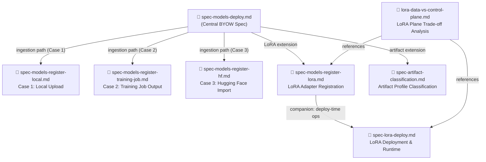

# BYOW Spec — File Structure & Relationships

## Diagram

---

## File Descriptions

| File | Type | Description |
|---|---|---|
| [spec-models-deploy.md](spec-models-deploy.md) | **Central spec** | End-to-end BYOW spec. Covers full-weight model registration (all three ingestion paths), deployment template resolution via the base model, and model deployment on managed compute via the acceleratorDeployments ARM API. All other spec files are extensions or companions to this one. |
| [spec-models-register-local.md](spec-models-register-local.md) | Ingestion spec | **Case 1 — Local upload.** Three-step flow: `startPendingUpload` → direct `azcopy` upload to SAS URI → `PutModel` registration. Primary and most common ingestion path. |
| [spec-models-register-training-job.md](spec-models-register-training-job.md) | Ingestion spec | **Case 2 — Training job output.** Single-step registration referencing a completed Foundry training job. The service resolves the output checkpoint and copies weights into project storage. Includes a full Train → Register → Deploy end-to-end sample. |
| [spec-models-register-hf.md](spec-models-register-hf.md) | Ingestion spec | **Case 3 — Hugging Face import.** Single-step registration from a HF Hub repo ID. Supports public repos and gated/private repos via HF API token. |
| [spec-models-register-lora.md](spec-models-register-lora.md) | Extension spec | LoRA adapter registration. Mirrors the three ingestion paths from full-weight registration but with `weightType: "LoRA"`. Covers adapter schema, validation rules, and listing registered adapters. |
| [spec-lora-deploy.md](spec-lora-deploy.md) | Companion spec | LoRA deployment and runtime operations. Covers attaching/detaching adapters onto running deployments (hot-loading into live GPU memory), multi-LoRA serving, per-request adapter routing via the inference `model` field, and deployment template requirements. |
| [spec-artifact-classification.md](spec-artifact-classification.md) | Extension spec | Defines the `artifactProfile` field on model objects. The platform classifies uploaded artifact files at registration time (SafeTensors, pickle `.bin`, custom Python code) to route deployment infrastructure appropriately and surface advisory warnings. |
| [lora-data-vs-control-plane.md](lora-data-vs-control-plane.md) | Analysis doc | Trade-off analysis evaluating whether LoRA adapter attach/detach should be **data-plane** (current spec) or **control-plane** (ARM) operations. Documents the rationale for the data-plane decision across latency, versioning, and governance dimensions. |
| [ui-experience-outline.md](ui-experience-outline.md) | UX guidance | Designer-facing document covering the portal registration flow for full-weight models and LoRA adapters. Includes guiding principles, inline validation behavior, and error messaging guidelines. References all registration and artifact classification specs. |
| [sdk-alignment-gaps.md](sdk-alignment-gaps.md) | Tracking doc | Tracks gaps between the spec and the SDK implementation — fields, operations, or behaviors defined in the spec that are not yet reflected in the `azure-ai-projects` SDK. |
